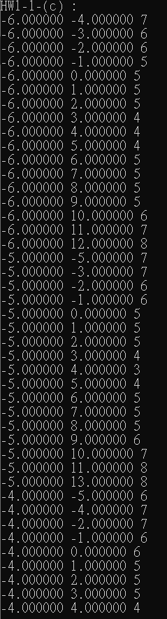

# 2D-Root-finding_using_Newton_Method

## Problem Description & Research result
 
針對以上方程組:  
1.A. 代入初始解 [2.0, 4.0] ，並列出迭代過程中的 [x , y]。  
  
1.B. −6 ≤ 𝑥 ≤ 12 , −5 ≤ y ≤ 13，列出所有會收斂的格點 [x, y]。  
  
1.C. 以 B 所列條件代入牛頓法運算時，收斂條件為|𝑒𝑛 − 𝑒𝑛−1| ≤ 10e−6，norm 為 2-norm，當代入的格點會收斂時，列出迭代次數(iteration)。  

1.D. 以 B 所列條件代入牛頓法運算時，當發生 發散結果時，加入干擾(perturbation)/修正值到初始解再進行一次運算，看結果是否依然發散。  

2.A. 畫出f(x)和 g(x)的函數圖形，−6 ≤ 𝑥 ≤ 12 , −5 ≤ y ≤ 13。  
2.B. 畫出收斂/發散途徑。  
3.   標示出在該條件(−6 ≤ 𝑥 ≤ 12 , −5 ≤ y ≤ 13)中，哪些區域會發生收斂及發散。  

2-A:如圖，雙曲線為g(x)，圓形為f(x)  
2-B:發散途徑為紅線  
3:圖中綠色點為收斂/紅點為發散(被紅線覆蓋)    
4.A. 試著解釋發生收斂結果的原因為何? 跟初始解的關聯。   
4-A:根據1-B的結果可看出若座標相加(x+y)為奇數時才有可能發生發散，但原因不明；
再來根據作圖後的結果可看出雙曲線的對稱線上所有點都是發散的，而在該例中對稱線也剛好經過圓心；
最後根據4-B(下題)的結果可看出當eigenvalues的值相除結果為0或無限(除0)時，會發生發散。   
4.B. 計算 Jacobiam matrix 的 eigenvalues(𝜆𝑚𝑎𝑥, 𝜆𝑚𝑖𝑛)，並計算C =|𝜆𝑚𝑎𝑥|/|𝜆𝑚𝑖𝑛|，觀察 C 的大小是否與收不收斂有一定的關聯。

